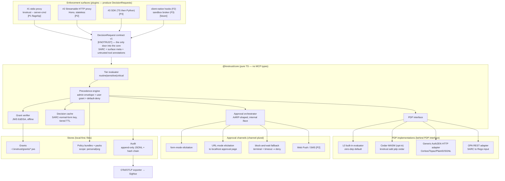
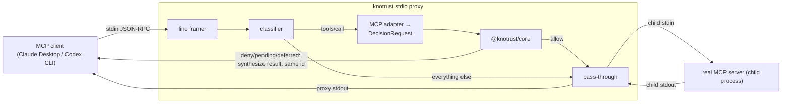
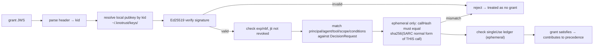
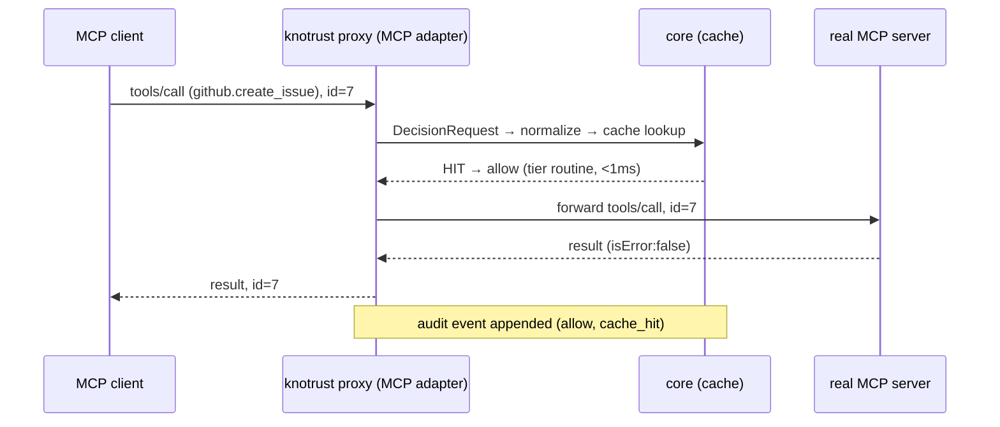
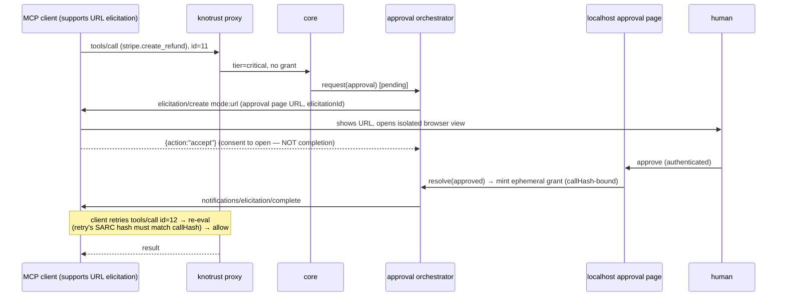

# KnoTrust — System Architecture

**Status:** Ratified for Phase 0/1 build · **Date:** 2026-07-03 (patched same day per brief §I Wave-4 adjudications) · **Author:** Systems Architect
**Source of truth:** `knotrust_prd_v5.md` + `docs/05-decisions/2026-07-03-decisions-brief.md` (brief wins on conflict; §I rulings are binding) + Wave-1 research corpus (`docs/01-research/*`).
**Audience:** engineers implementing Phase 0 (dogfood) and Phase 1 (OSS flagship). This document is the contract they build against.

> This is the *architecture*, not the implementation plan. It fixes the interfaces, the package boundaries, the invariants, and the wire shapes. Where an input was ambiguous, a call is made inline and marked **(decision: X, rationale: Y)**.

---

## 0. Reading conventions

**Standards-maturity legend** — used throughout; keep it precise, it is a claims-discipline requirement (PRD §4):

| Marker | Meaning | Applies to |
|---|---|---|
| **[STANDARD]** | Ratified, IP-protected, not subject to revision | AuthZEN Authorization API 1.0 Final (2026-01-12) |
| **[RC]** | Release Candidate, locked but not published | MCP 2026-07-28 (locked 2026-05-21; final ~2026-07-28) |
| **[DRAFT]** | Working Group Draft 1 — actively churning, wire format unstable | AARP/ARAP, COAZ |
| **[KNOTRUST]** | Our own internal contract; we own it and version it | DecisionRequest v1, grant schema, outcome enum |

**Phase markers:** `[P0]` dogfood · `[P1]` OSS launch · `[P2]` HTTP + voice · `[P3]` SDK + widen · `[P4/5]` commercial/enterprise. Anything without a marker is P0/P1 core. Every P2+ element is explicitly marked so Phase 0/1 scope stays crisp.

**Spec terms we use (never invent spec vocabulary):** *SARC* (Subject-Action-Resource-Context; our shorthand, not AuthZEN's own term but used by the COAZ text) · *Requestable Denial* (AARP's mechanism; **not** "deny-with-prerequisite," which is our internal gloss only) · the four outcomes `allow | deny | pending_approval | deferred_not_eligible` · *PEP/PDP* (AuthZEN-defined; PIP/PAP are **not** AuthZEN roles and are not used normatively).

---

## 1. Overview & component map

KnoTrust is a **PEP** (Policy Enforcement Point): a thin enforcement edge in front of the MCP action surface that maps each `tools/call` into a **DecisionRequest**, resolves it through a **surface-agnostic decision core**, and enforces the outcome — allowing, denying, holding for human approval, or deferring. It is *not* a policy engine; it *fronts* one (PRD §2, brief §B1).

The load-bearing structural principle (PRD §8, brief §E1): **enforcement surfaces are plugins that produce `DecisionRequest`s into a core that knows nothing about MCP.** The MCP proxy is surface #1. Client-native hooks (F2) and the OS sandbox broker (F3) are future surfaces that reuse the same core unchanged. The core must not import MCP types — this is a checked package boundary (§12).



**Data-flow in one sentence:** surface → `DecisionRequest` → cache lookup (fast path) → on miss, tier + precedence + grants + PDP → outcome → (if critical & no grant) approval orchestrator → channel → resolution → ephemeral grant → re-evaluate → outcome → surface enforces → audit event appended for *every* step.

---

## 2. The DecisionRequest contract v1 [KNOTRUST]

This is the single most load-bearing interface in the system (brief §E1). It is **internal, versioned, and the only way any surface reaches the core.** It carries SARC in COAZ shape (human principal in `subject`, agent identity in `context.agent`, **never merged** — brief §C4), surface metadata, and tool annotations *explicitly marked untrusted* (brief §C5). It deliberately expresses nothing in MCP vocabulary; the MCP adapter translates JSON-RPC into it.

```typescript
/** @knotrust/core — no dependency on @modelcontextprotocol/sdk anywhere in this file. */
export interface DecisionRequest {
  contractVersion: "1.0";            // bumped on any breaking shape change
  requestId: string;                 // ULID; correlates request → decision → approval → audit
  timestamp: string;                 // RFC 3339 (profiled subset of ISO 8601, ADR-0017), when the surface produced the request

  // ---- SARC (COAZ profile; AuthZEN Information Model) ----
  subject: Subject;                  // the HUMAN principal the agent acts for
  action: Action;                    // the tool verb
  resource: Resource;                // the target object, derived from tool arguments
  context: DecisionContext;          // environment + AGENT identity (context.agent)

  // ---- Surface + provenance metadata ----
  surface: SurfaceMetadata;

  // ---- Tool annotations: SEEDS, NEVER TRUST (brief §C5, MCP schema.ts MUST) ----
  toolAnnotations?: UntrustedToolAnnotations;
}

export interface Subject {                       // AuthZEN Subject: REQUIRED type,id
  type: "user" | "service";
  id: string;                                    // e.g. "avijeett007@gmail.com"
  properties?: {
    authn?: "os_session" | "jwt_sub" | "unauthenticated";
    tenant?: string;                             // present even in P1 (schema-forward for P2 org scope)
    [k: string]: unknown;
  };
}

export interface Action {                        // AuthZEN Action: REQUIRED name
  name: string;                                  // fully-qualified verb, e.g. "stripe.create_refund"
  properties?: { mcpMethod?: string; [k: string]: unknown };
}

export interface Resource {                      // AuthZEN Resource: REQUIRED type,id
  type: string;                                  // e.g. "stripe_charge", "github_repo"
  id: string;                                    // e.g. "ch_3P..." or "kno2gether/openclaw"
  properties?: Record<string, unknown>;          // conditions material: amount, path, labels...
}

export interface DecisionContext {
  /** COAZ: agent identity lives HERE, sibling to subject — never in subject. [DRAFT-tracked] */
  agent: AgentIdentity;
  env: {
    time: string;                                // RFC 3339 (profiled subset of ISO 8601, ADR-0017)
    surfaceLocal: boolean;                       // human-at-keyboard vs remote/unattended
    voiceSession?: boolean;                      // drives deferred_not_eligible eligibility
    [k: string]: unknown;
  };
  arguments?: Record<string, unknown>;           // raw tool-call arguments (verbatim); hashed into SARC normal form + audit argsHash, never logged raw
}
```

*Added 2026-07-03 (P0-E3-T3): `context.arguments` restores the plan's hashed-field list for call-hash binding.*

```typescript
export interface AgentIdentity {
  id: string;                                    // stable KnoTrust agent id, e.g. "claude-desktop"
  type: "ai_agent" | "workload" | "user";        // AARP client.actor.type vocabulary
  clientId?: string;                             // OAuth client_id if available (COAZ derives agent from token.client_id)
  model?: string;                                // advisory only
}

export interface SurfaceMetadata {
  kind: "stdio_proxy" | "http_proxy" | "sdk" | "client_hook" | "sandbox_broker";
  instanceId: string;
  server?: string;                               // logical MCP server name being fronted
  specVersion?: "2025-11-25" | "2026-07-28";     // MCP spec the surface negotiated
  transport?: "stdio" | "streamable_http";
}

/** Everything here is self-declared by the server and MAY be a lie. */
export interface UntrustedToolAnnotations {
  trusted: false;                                // literal false — a constant reminder at the type level
  source: "server_advertised";
  readOnlyHint?: boolean;
  destructiveHint?: boolean;
  idempotentHint?: boolean;
  openWorldHint?: boolean;
  capturedAt?: string;                           // RFC 3339 (profiled subset of ISO 8601, ADR-0017); from the tools/list snapshot
}
```

**Full JSON example — `github.create_issue` (routine/sensitive, allowed from a durable grant):**

```json
{
  "contractVersion": "1.0",
  "requestId": "01JZ8Q3M9X7R2K4V6B0YHTDC1A",
  "timestamp": "2026-07-03T14:32:10.221Z",
  "subject": { "type": "user", "id": "avijeett007@gmail.com",
               "properties": { "authn": "os_session", "tenant": "kno2gether" } },
  "action": { "name": "github.create_issue", "properties": { "mcpMethod": "tools/call" } },
  "resource": { "type": "github_repo", "id": "kno2gether/openclaw",
                "properties": { "title": "Race in proxy shutdown", "labels": ["bug"] } },
  "context": {
    "agent": { "id": "claude-desktop", "type": "ai_agent", "clientId": "mcp-client-abc",
               "model": "claude-opus-4-x" },
    "env": { "time": "2026-07-03T14:32:10Z", "surfaceLocal": true }
  },
  "surface": { "kind": "stdio_proxy", "instanceId": "px_01JZ8Q3", "server": "github-mcp",
               "specVersion": "2025-11-25", "transport": "stdio" },
  "toolAnnotations": { "trusted": false, "source": "server_advertised",
                       "readOnlyHint": false, "destructiveHint": false,
                       "idempotentHint": false, "openWorldHint": true,
                       "capturedAt": "2026-07-03T14:30:00Z" }
}
```

**Full JSON example — `stripe.create_refund` (critical, escalates to human):**

```json
{
  "contractVersion": "1.0",
  "requestId": "01JZ8Q4T0F5N8P2Q7C3WERKD9B",
  "timestamp": "2026-07-03T14:40:02.005Z",
  "subject": { "type": "user", "id": "avijeett007@gmail.com",
               "properties": { "authn": "os_session", "tenant": "kno2gether" } },
  "action": { "name": "stripe.create_refund", "properties": { "mcpMethod": "tools/call" } },
  "resource": { "type": "stripe_charge", "id": "ch_3PabcXYZ",
                "properties": { "amount": 42000, "currency": "usd", "reason": "requested_by_customer" } },
  "context": {
    "agent": { "id": "codex-cli", "type": "ai_agent", "clientId": "codex-mcp" },
    "env": { "time": "2026-07-03T14:40:01Z", "surfaceLocal": true }
  },
  "surface": { "kind": "stdio_proxy", "instanceId": "px_01JZ8Q4", "server": "stripe-mcp",
               "specVersion": "2025-11-25", "transport": "stdio" },
  "toolAnnotations": { "trusted": false, "source": "server_advertised",
                       "destructiveHint": true, "readOnlyHint": false }
}
```

**How `resource` is derived from arguments (COAZ `x-coaz-mapping`):** the SARC-mapping config (per-tool, config-not-code — PRD §12) maps tool arguments into `resource.type/id/properties`. Defaults: `action.name = tool name`, `resource` from arguments, `subject` from session/JWT. The COAZ `x-coaz-mapping` extension on a tool's `inputSchema` (CEL expressions) is honored **when present and from a trusted pack**, otherwise our own mapping config wins. The COAZ wire shape lives behind an adapter (§10) because it is `[DRAFT]`.

---

## 3. Decision outcomes

The core returns exactly four outcomes (brief §E2). This enum is `[KNOTRUST]` and stable; AARP/COAZ wire vocabulary is translated to/from it at the adapter boundary only.

```typescript
export type Outcome = "allow" | "deny" | "pending_approval" | "deferred_not_eligible";

export interface DecisionResponse {
  contractVersion: "1.0";
  requestId: string;
  decisionId: string;                 // ULID; the audit anchor
  outcome: Outcome;
  tier: "routine" | "sensitive" | "critical";
  reasonCode: string;                 // machine-stable, e.g. "no_grant_critical", "policy_deny"
  reasonUser?: string;                // model-facing, injection-conscious (see below)
  reasonAdmin?: string;               // audit-only; may name policy ids, matched rules
  approval?: ApprovalHandleRef;       // present iff outcome === "pending_approval"
  requestable?: {                     // present iff outcome === "deny" and the denial is requestable
    how: string;                      // exact CLI invocation template, e.g. `knotrust grant --tool <tool> --server <server>`
  };
  cache: { hit: boolean; ttlSeconds?: number };
  evaluatedBy: "L0" | "cedar" | "authzen_http" | "opa" | "grant";
  latencyMs: number;
}
```

*Added 2026-07-03 (P0-E2-T2): `requestable` carries the Requestable-Denial guidance the plan's Decision union always specified.*

Ruled during P0-E2-T1: the handle reference shape referenced above.

```typescript
export type ApprovalState =
  "requested" | "pending" | "approved" | "denied" | "expired" | "cancelled";

/** Core-side reference to an approval task handle (maps to AARP task handle at the adapter). */
export interface ApprovalHandleRef {
  id: string;                      // "apr_<ULID>"
  state: ApprovalState;
  expiresAt?: string;              // RFC 3339 (profiled subset of ISO 8601, ADR-0017); deadline after which the approval resolves as deny
}
```

**Mapping to AuthZEN (for the docs, so we stay standards-honest):** AuthZEN 1.0's core `decision` is a bare boolean `[STANDARD]`. `allow` = `{decision:true}`; `deny` = `{decision:false}`. `pending_approval` and `deferred_not_eligible` are **not first-class AuthZEN decision values** — under 1.0 they can only ride in the freeform `context` (no interop guarantee), and their purpose-built home is AARP's **Requestable Denial** (`decision:false` + `context.access_request`) and Task state machine `[DRAFT]`. We therefore keep our own outcome enum and translate at the adapter; we never wire our enum directly onto AARP's field names (research authzen §5).

### 3.1 Response envelope on the MCP surface

Per brief §C6 and the MCP error-channel rules: a policy decision is surfaced as a **Tool Execution Error** — a normal `result` with `isError:true` and structured content — reusing the **same JSON-RPC `id`** as the client's request. It is **never** a JSON-RPC protocol error (`error{}`); protocol errors are reserved for malformed traffic. This lets the model see and adapt to the outcome in-context, exactly as the spec intends for self-correctable failures (SEP-1303).

**`allow`** — transparent pass-through; the client sees the real server's result unchanged. (No envelope of ours.)

**`deny`:**

```json
{
  "jsonrpc": "2.0", "id": 42,
  "result": {
    "isError": true,
    "content": [{ "type": "text",
      "text": "This action was blocked (critical tier) and was not performed. A human can approve it via the KnoTrust approval page or terminal prompt. Do not retry automatically; tell the user it needs their approval." }],
    "structuredContent": {
      "knotrust": { "outcome": "deny", "decisionId": "01JZ8Q5...", "tier": "critical",
                    "reasonCode": "no_grant_critical", "retryable": false,
                    "humanApproval": { "possible": true, "via": "knotrust_approval_page" } }
    }
  }
}
```

**`pending_approval`** (returned only when the call cannot be held synchronously — URL-mode handoff that outlives the request, voice/SDK async, stateless HTTP; block-and-wait holds the call and resolves to a terminal outcome instead — ratified as canonical, brief §I1; §6):

```json
{
  "jsonrpc": "2.0", "id": 42,
  "result": {
    "isError": true,
    "content": [{ "type": "text",
      "text": "This action is awaiting human approval and has not been performed yet. You may tell the user approval is pending. Do not retry until it is approved." }],
    "structuredContent": {
      "knotrust": { "outcome": "pending_approval", "decisionId": "01JZ8Q6...",
        "approval": { "handle": "apr_01JZ8Q6", "status": "pending", "channel": "elicitation_url",
                      "expiresAt": "2026-07-03T14:45:02Z" },
        "retryable": true, "retryAfterSeconds": 5 }
    }
  }
}
```

**`deferred_not_eligible`** (e.g. a critical action mid-voice-call, PRD §10):

```json
{
  "jsonrpc": "2.0", "id": 42,
  "result": {
    "isError": true,
    "content": [{ "type": "text",
      "text": "This action is not available in the current context and cannot be approved here. Let the user know they can perform or approve it later from a KnoTrust-enabled surface." }],
    "structuredContent": {
      "knotrust": { "outcome": "deferred_not_eligible", "decisionId": "01JZ8Q7...",
                    "reasonCode": "channel_not_eligible", "retryable": false }
    }
  }
}
```

### 3.2 Prompt-injection-conscious denial message design (ratified two-layer design, brief §I3)

The denial text the **model** sees and the record the **audit log** keeps are deliberately different (PRD §13, brief §E4, §I3):

- **To the model (`reasonUser` / `content.text`):** exactly three ingredients — the denial/pending **status**, the **tier class**, and **"a human can approve via …"** (the channel name only). Actionable, and **zero policy internals**: no rule IDs, no thresholds, no matched-policy names, no missing-grant details, no admin-envelope shape, no workaround hints — nothing the model (or an injected instruction riding in tool output) could use to reason about *how to get the call approved*. It never contains an approval URL/token when the surface is the model's own channel (approval material goes to the human's out-of-band channel, not into model-readable content). Nothing in this string is phrased as a negotiable condition.
- **To the audit log + human channels (`reasonAdmin`):** full rationale — matched policy/pack id and rule, principal, agent identity, resource, argument hash, tier derivation, which precedence layer denied, evaluating PDP, and whether a fail-open class was involved. This is the forensic record and never reaches the model.
- **Probing detection:** repeated-denial patterns (same agent re-attempting a denied action, or sweeping argument variants against a denied tool) are **flagged in audit** as a `probe_flagged` event (§9.1), so an injected "keep trying variations" strategy is visible to the human even though each individual denial stays terse.

This split is the concrete expression of invariant §E4 ("policy/grants out-of-band from model reasoning"): the model can *observe* that it was denied and adapt conversationally, but it cannot *learn the shape of the fence* well enough to talk its way over it.

---

## 4. stdio proxy internals (surface #1) [P1 flagship]

### 4.1 Process model

`knotrust -- <server-cmd> [args...]` — zero code, no daemon, no resident process, single session (PRD §9). The proxy:

1. Reads its own config (`knotrust.config.ts|yaml|json` via `c12`), loads policy bundle + packs + local grants + identity pubkey.
2. **Spawns the real MCP server** as a child process (`child_process.spawn`), inheriting the environment (stdio auth is env-based — MCP §8 exempts stdio from OAuth).
3. Wires three pipes: client→proxy on the proxy's own stdin, proxy→child on the child's stdin, child→proxy on the child's stdout, proxy→client on the proxy's own stdout. The child's **stderr passes straight through** (MCP permits arbitrary server logging on stderr).
4. Frames JSON-RPC line-by-line (one message per line, no embedded newlines — MCP stdio rule).



### 4.2 Interception rules

- **`tools/call` → ALWAYS parse the JSON-RPC body for the decision** (brief §C2). We never trust headers for allow/deny. Even once MCP 2026-07-28 `Mcp-Method`/`Mcp-Name` exist, SEP-2243 forbids treating them as trusted for security decisions and mandates servers reject header/body mismatch (`-32001 HeaderMismatch`). Headers are routing/telemetry only. On stdio there are no headers at all, so this is moot for surface #1 and becomes relevant only for surface #2.
- **`tools/list` → pass through, capture annotations.** The response is forwarded unmodified (preserving `nextCursor` pagination), but the proxy snapshots each tool's `annotations` into the annotation cache to *seed suggested tiers* (never to trust — §8). Optionally, config may rewrite `description`/annotations to advertise KnoTrust governance to the model; default is untouched.
- **Everything else** (`initialize`, `resources/*`, `prompts/*`, `notifications/*`, `ping`, sampling, progress) → **transparent pass-through.** `notifications/cancelled` and `notifications/progress` relay in real time; SSE event ids (surface #2) relay faithfully or client reconnection breaks.
- **Deny/pending/deferred** → the proxy **synthesizes a `result` reusing the client's original `id`** (§3.1) and does **not** forward the call to the child. JSON-RPC correlation is purely by `id`; losing it breaks the client.

### 4.3 Error & crash behavior — fail closed (PRD §13, brief §E3)

| Condition | Behavior |
|---|---|
| Child server crashes / exits | Proxy stops forwarding; in-flight `tools/call` return `deny` (`reasonCode: "server_unavailable"`); proxy exits non-zero after relaying. **Never** silently allow. |
| Malformed JSON-RPC from client | Relay as a genuine **protocol error** (`-32700`/`-32600`) — this is the one legitimate use of the error channel. |
| Body unparseable for a `tools/call` | **Fail closed** — `deny` (`reasonCode: "unparseable_body"`), audited. |
| Store/cache read error | **Fail closed** by default; `deny`. Fail-open only if the tool's class is explicitly configured fail-open (§7), and every such firing is audited. |
| PDP adapter timeout/unreachable | **Fail closed** for sensitive/critical; routine may fail-open only if configured. Audited. |
| Approval channel unavailable & tier critical | Fall through the channel chain (§6); if none resolve before timeout ⇒ `deny`. |

### 4.4 Latency budget (engineering targets)

Targets are added-overhead-over-passthrough, p50 on a typical (~1 KB) argument payload, Node ≥ 22. **(decision: numeric targets below are engineering budgets, not measured; rationale: no code exists yet — they set the bar Phase 0 validates, and PRD §8/§13 promise a "sub-ms common case" that must be met by the cache, per brief §C2.)**

| Path | Steps | Target (added p50) |
|---|---|---|
| **Cache hit (routine/sensitive)** | line parse → SARC normalize → cache lookup (in-mem Map) | **< 1 ms** (JSON parse dominates on large args) |
| **L0 policy eval (cache miss)** | + tier + precedence + grant verify (Ed25519) + L0 rules | **1–3 ms** |
| **Cedar-WASM eval (cache miss)** | + WASM `is_authorized` (instance warm) | **2–6 ms** |
| **External PDP (AuthZEN HTTP / OPA REST)** | + localhost round-trip | **3–20 ms** (network-bound) |
| **Grant verify only** | Ed25519 JWS verify against local pubkey | **0.3–1 ms** |
| **Critical escalation (block-and-wait)** | human in loop | bounded by `approval.timeoutSeconds` (**default 300 s**), timeout ⇒ deny |

---

## 5. Grant model [KNOTRUST]

A **grant is a pre-satisfied prerequisite** (PRD §7). It is the core primitive that makes KnoTrust "encode a durable, risk-tiered grant once, enforced regardless of client approval mode" (PRD §4). Grants are **signed and offline-verifiable**.

### 5.1 Format: JWS Compact, EdDSA (Ed25519)

- **Signing:** Ed25519 via audited `@noble/curves` (TS/browser); Python side uses `cryptography` (`Ed25519PrivateKey`) `[P3]`. Serialization: **JWS Compact, `alg: EdDSA`** (brief §D). JWS signs the base64url string directly → no JSON canonicalization ambiguity. Golden cross-language test vectors from day 1 (brief §F).
- **Keys:** **OS keychain via `@napi-rs/keyring` is the default where available** (never dead `keytar`), with a `~/.knotrust/identity.key` file fallback (Ed25519, `0600` from creation — stricter than AWS CLI defaults) elsewhere (ratified, brief §I2.1; supersedes the earlier file-default call in Appendix B). **This is hardening, not a boundary:** an agent executing arbitrary code as the same user defeats keychain ACLs too — an ungated same-account shell defeats any local control. The sandbox recommendation is load-bearing (PRD §3); the separate-principal sandbox broker (F3) is the era where this becomes a real boundary.
- **JWS header:** `{ "alg": "EdDSA", "typ": "knotrust-grant+jws", "kid": "<pubkey-id>" }`.

### 5.2 Claim schema

Human-readable interface (wire uses short claim names to control size — mapping table below; short names matter for URL-mode elicitation embedding and future QR transfer, research crypto §7.2):

```typescript
export interface GrantClaims {
  v: 1;                              // grant schema version
  jti: string;                       // ULID grant id (revocation + single-use ledger key)
  iat: number; exp: number; nbf?: number;
  iss: string;                       // granted_by: the minting authority identity
  kind: "durable" | "ephemeral";     // ephemeral = single-use, minted on approval
  singleUse: boolean;                // true ⇒ consumed atomically on first match

  principal: { type: "user" | "service"; id: string };   // the HUMAN
  agent: { id: string; type: "ai_agent" | "workload" | "user" } | "*"; // "*" = any agent
  tool: string;                      // pattern: exact "stripe.create_refund" or glob "github.*"
  scope: {                           // resource scope
    resourceType?: string;           // e.g. "stripe_charge"
    idPattern?: string;              // e.g. "ch_*" or "kno2gether/*"
  };
  conditions?: Record<string, unknown>; // e.g. { maxAmount: 5000, currency: "usd", pathPrefix: "/tmp" }
  tier: "routine" | "sensitive" | "critical";  // the tier this grant satisfies (cannot exceed minter's)
  envelopeScope: "personal" | "org"; // which policy scope minted it (schema-forward, brief §E7)
  admin?: boolean;                   // minted under an admin/org envelope
  /** REQUIRED iff kind === "ephemeral" (brief §I2.3): sha256 of the SARC normal form (§7.1,
   *  minus policyVersion/grantSetVersion) of the EXACT call the human approved. Verification
   *  requires the executing call's SARC hash to match — closes approve-X-execute-Y (TOCTOU). */
  callHash?: string;
}
```

**Wire short-name mapping:** `v,jti,iat,exp,nbf,iss` (JWT-standard) · `k`=kind · `su`=singleUse · `p`=principal · `ag`=agent · `t`=tool · `s`=scope · `c`=conditions · `r`=tier · `es`=envelopeScope · `ad`=admin · `ch`=callHash.

**Example (decoded payload of a durable grant):**

```json
{ "v":1, "jti":"01JZ8QAGRANT001", "iat":1751553600, "exp":1754145600,
  "iss":"user:avijeett007@gmail.com", "k":"durable", "su":false,
  "p":{"type":"user","id":"avijeett007@gmail.com"}, "ag":"*",
  "t":"github.*", "s":{"resourceType":"github_repo","idPattern":"kno2gether/*"},
  "r":"sensitive", "es":"personal" }
```

**Example (decoded payload of an ephemeral grant minted on approval — note `ch`):**

```json
{ "v":1, "jti":"01JZ8QEPHEM0001", "iat":1751553842, "exp":1751553962,
  "iss":"user:avijeett007@gmail.com", "k":"ephemeral", "su":true,
  "p":{"type":"user","id":"avijeett007@gmail.com"},
  "ag":{"id":"codex-cli","type":"ai_agent"},
  "t":"stripe.create_refund", "s":{"resourceType":"stripe_charge","idPattern":"ch_3PabcXYZ"},
  "r":"critical", "es":"personal",
  "ch":"sha256:9f2c1e...d41b" }
```

### 5.3 Durable vs ephemeral

- **Durable** = pre-authorization written by `knotrust grant ...`; long TTL; `singleUse:false`; the fast-path enabler.
- **Ephemeral** = minted by the approval orchestrator the instant a human approves an escalation (§6); `kind:"ephemeral"`, `singleUse:true`, short `exp` (**decision: default 120 s**), tightly scoped to the exact `{principal, agent, tool, resource.id}` that was approved, **and bound to the exact approved call via `callHash`** (brief §I2.3): the executing call's SARC-normal-form hash must equal the grant's `callHash` or the grant does not match — the human approves *this call*, not "one free critical call." It is a one-shot pre-satisfied prerequisite consumed on re-evaluation.

### 5.4 Verification flow (offline)



Verification is **fully local** — no network, no PDP call. A grant that fails any check is treated as absent (fail-closed), not as a deny reason the model sees.

### 5.5 Precedence engine (PRD §7, brief §B1)

Strict ordering, evaluated top-down; first decisive layer wins:

1. **Admin/org envelope** (outer). Can *force* approval or deny on a tier regardless of any user grant. Sets the ceiling: no user grant can exceed it.
2. **User (personal) grant.** Operates only *within* the admin envelope. A matching, valid grant that is within-ceiling ⇒ `allow`.
3. **Default.** Unknown/unannotated/critical-without-grant ⇒ **deny** (fail-closed). Routine may resolve via configured defaults.

**No self-escalation (invariant):** (a) a grant's `tier`/scope can never exceed the authority that minted it (checked: `iss` must hold ≥ the granted tier under the envelope); (b) ephemeral grants minted on approval cannot exceed the admin envelope; (c) **nothing the agent says can create or widen a grant** — grant creation is out-of-band (`knotrust grant`, or approval by an authenticated human), never derivable from in-band model/tool content (invariant §E4). Self-approval via in-band content is a named threat-model case with tests (brief §E4).

### 5.6 Revocation semantics per mode (brief §B2) — stated exactly

| Mode | Mechanism | Honest claim |
|---|---|---|
| **Local (P1, single machine)** | store *is* the cache. `knotrust revoke <jti>` deletes the grant file and adds `jti` to a local revocation set; affected decision-cache entries purged. | Takes effect on the **next decision** — effectively immediate, and we may say so **for this mode only**. |
| **Control-plane (P2+)** | edges sync signed policy/grant bundles (TUF-style versioned metadata). Revocation lands via bundle sync or push invalidation. | **"Propagates within the configured sync interval (default 30 s), or on push invalidation when connected."** TTL-bounded, **never "instant."** |

Decision-cache entries for `sensitive`/`critical` carry TTL ≤ 60 s (§7) so even a stale-bundle window is bounded. All revocation marketing routes through this table (claims discipline, PRD §4). In pure-local zero-network mode, revocation of a *durable* grant is TTL-bounded only if you cannot reach the store — but since local mode's store *is* local, deletion is immediate; the TTL bound is the honest claim for the offline control-plane-edge case (research crypto §8).

---

## 6. Approval orchestrator [P1 core]

The orchestrator implements the approval lifecycle **behind an internal interface shaped like AARP's Requestable Denial** flow — access request → task handle → status → re-evaluate — but the AARP *wire format* is an adapter concern only, because AARP is `[DRAFT]` (Draft 1, actively rewritten, open PR as of 2026-07-02; brief §B5). We implement **approval-only**; the full prerequisite taxonomy (step-up auth, attestations) is explicitly out of v1.

### 6.1 Internal lifecycle & interface

```typescript
export type ApprovalState =
  "requested" | "pending" | "approved" | "denied" | "expired" | "cancelled";

export interface ApprovalRequest {
  decisionId: string; requestId: string;
  subject: Subject; agent: AgentIdentity; action: Action; resource: Resource;
  tier: "sensitive" | "critical";
  eligibleChannels: ApprovalChannelKind[];   // filtered by surface + client capability + context
  timeoutSeconds: number;                    // default 300; timeout ⇒ deny
}

export interface ApprovalHandle {
  id: string;                                // "apr_<ULID>" — maps to AARP task handle
  state: ApprovalState;
  // On stateless HTTP (P2), id is encoded into requestState (SEP-2322 MRTR).
}

export interface ApprovalOrchestrator {
  request(req: ApprovalRequest): Promise<ApprovalHandle>;         // → requested → pending
  status(id: string): Promise<ApprovalHandle>;
  resolve(id: string, r: "approved" | "denied"): Promise<void>;   // called by a channel on human action
  cancel(id: string): Promise<void>;
  onResolved(id: string): Promise<ApprovalState>;                 // awaited by block-and-wait
}
```

State machine: `requested → pending → (approved | denied | expired | cancelled)`. On `approved`, the orchestrator asks the grant service to **mint an ephemeral single-use grant** (§5.3), then triggers a **re-evaluation** of the original `DecisionRequest` — the PDP stays authoritative; approval alone never bypasses re-evaluation (AARP completion semantics). This maps cleanly onto AARP's Task Status enum (`pending/approved/denied/expired/cancelled`) at the adapter, but our enum is the stable one.

### 6.2 Channel-plural design (brief §C3)

The approval subsystem is channel-plural **from day one** — elicitation is a *path, not the mechanism* (client support is uneven: solid in Claude Code, broken in Claude Desktop today, in-progress in Codex CLI, form-only in Cursor). Channels are tried in a configured order; the first *available* one presents the request; **block-and-wait is the always-available floor that makes the flagship demo work on every client.**

```typescript
export type ApprovalChannelKind =
  "elicitation_form" | "elicitation_url" | "block_and_wait" | "web_push" | "sms";

export interface ApprovalChannel {
  readonly kind: ApprovalChannelKind;
  available(req: ApprovalRequest, surface: SurfaceMetadata): boolean;
  present(req: ApprovalRequest, handle: ApprovalHandle): Promise<void>;
  // Human action flows back via orchestrator.resolve(handle.id, ...).
}
```

- **`elicitation_form` [P1]** — MCP `elicitation/create` form-mode for a simple confirm, where the client supports it. Never used for sensitive credential entry (MCP MUST). Progressive enhancement only.
- **`elicitation_url` [P1]** — MCP URL-mode elicitation (2025-11-25 SEP-1036) bounces the human to the **localhost approval page** served by the proxy itself (also the P1 approval UI). `{action:"accept"}` means *consent to open the URL*, not completion; completion arrives when the human approves on the page and the channel calls `resolve()`. The page is a URL-mode target, not a bolt-on (PRD §9).
- **`block_and_wait` [P1, the floor]** — the proxy **holds the `tools/call`**, prints the approval URL/code to the terminal (and/or notifier), and awaits `onResolved()`. Resolves to a terminal outcome: approved ⇒ re-evaluate ⇒ `allow`; denied/timeout ⇒ `deny` (timeout ⇒ deny is audited, fail-closed). Because it holds synchronously, block-and-wait returns a terminal outcome to the client, **not** `pending_approval`.
- **`web_push` / `sms` [P2]** — PWA Web Push + Twilio SMS for async/voice; these return `pending_approval` to the surface because the call cannot be held.

The localhost approval page authenticates the *human* via the OS session (P1) / authenticated app (P2) — invariant §E4. It never accepts an approval derived from model-readable content.

**Loopback hardening (ratified requirements, brief §I2.2):**

- **Unguessable single-use tokens:** every approval URL carries a cryptographically random, single-use token bound to the approval handle; it is invalidated on first use and on handle expiry.
- **Human-only delivery:** the tokened URL is delivered to the **human** via terminal/notifier (or the client's URL-elicitation UI channel, which the MCP spec requires be shown to the user and opened in an isolated browser view the LLM cannot inspect) — it is **never placed in model-visible content** (tool results, elicitation messages the model reads, denial envelopes).
- **Loopback bind:** the approval server binds `127.0.0.1` only — never `0.0.0.0`.
- **Origin/Host validation:** requests with unexpected `Origin`/`Host` headers are rejected (DNS-rebinding defense).
- **CSRF protection + POST-only mutations:** approve/deny are `POST` with a CSRF token; `GET` renders only — no state change on any `GET`.

### 6.3 Sequence diagrams

**(a) Routine cache-hit allow** (the "stop re-approving safe calls" moment):



**(b) Critical → block-and-wait → ephemeral grant → re-evaluate:**

```mermaid
sequenceDiagram
  participant CL as MCP client
  participant PX as knotrust proxy
  participant CO as core
  participant AO as approval orchestrator
  participant HU as human (terminal / localhost page)
  participant SR as real MCP server
  CL->>PX: tools/call (stripe.create_refund), id=9
  PX->>CO: DecisionRequest → tier=critical, no grant
  CO->>AO: request(approval)  [requested→pending]
  AO->>HU: print approval URL/code (block_and_wait); hold call
  HU-->>AO: APPROVE (authenticated on localhost page)
  AO->>CO: mint ephemeral single-use grant<br/>callHash = sha256(SARC of THIS call); resolve(approved)
  CO->>CO: RE-EVALUATE — SARC hash must match callHash → allow
  PX->>SR: forward tools/call, id=9
  SR-->>PX: result
  PX-->>CL: result, id=9
  Note over CO: audit: pending, approved, grant_minted, allow (all appended)
```

**(c) Critical via URL-mode elicitation** (standards-native out-of-band):



**(d) Voice / deferred outcome (SDK path) [P2 — sketch only]:**

```mermaid
sequenceDiagram
  participant AG as voice agent (Knotie/Knova, KnoTrust SDK)
  participant CO as core
  participant AO as approval orchestrator
  participant PUSH as Web Push / SMS
  AG->>CO: DecisionRequest (critical, context.env.voiceSession=true)
  alt not voice-eligible
    CO-->>AG: deferred_not_eligible (first-class outcome, PRD §10)
    Note over AG: agent says "this isn't something I can do on a call"
  else async approval acceptable
    CO->>AO: request(approval) [pending]
    AO->>PUSH: push/SMS to human's KnoTrust app
    CO-->>AG: pending_approval (handle) — agent handles conversationally
    PUSH-->>AO: approve later → mint grant (callHash-bound)
    Note over AG: next turn re-evaluates; now allowed
  end
```

---

## 7. Caching & fast path [P1 core]

The "sub-ms common case" (PRD §8/§13) is delivered by the **local decision cache**, *not* by header-only evaluation (brief §C2).

### 7.1 Key: hash of SARC normal form

```
cacheKey = SHA-256( canonicalJSON({
  s:  subject.id,
  a:  action.name,
  rt: resource.type,
  ri: resource.id,
  rp: <conditions-relevant resource.properties, sorted>,   // e.g. amount bucket, path prefix
  ag: context.agent.id,
  tier,
  policyVersion,        // bundle content-hash — see below
  grantSetVersion       // monotonic counter bumped on any grant add/revoke
}) )
```

Volatile fields (`requestId`, `timestamp`, raw env) are **excluded**. Including `policyVersion` + `grantSetVersion` in the key means **any policy or grant change automatically yields fresh keys** — stale entries are unreachable rather than wrong (versioned invalidation), and we *also* actively purge affected entries on revoke for prompt reclamation.

### 7.2 Tiered TTLs (PRD §10, brief §B2)

| Tier | Cacheable | TTL | Rationale |
|---|---|---|---|
| **routine** | yes | long (**default 1 h**) | high-volume safe calls; the fast-path population |
| **sensitive** | yes | **≤ 60 s** | bounds stale-grant/stale-bundle windows |
| **critical** | **never cached** | — | every critical call re-derives; approvals are per-instance |

### 7.3 Invalidation & failure posture

- **On grant change** (`grant`/`revoke`): bump `grantSetVersion` (invalidates by key) **and** purge entries matching the affected principal/tool/resource.
- **On policy/pack change:** `policyVersion` (bundle content-hash) changes ⇒ whole prior keyspace is unreachable.
- **Store/cache errors: fail closed by default** (deny). **Fail-open is per-class only, explicit config, and audited every time it fires** (invariant §E3, PRD §13) — reserved for latency-critical *routine* classes an operator has consciously opted into. A `fail_open` audit event records the class, the error, and the allowed call.

---

## 8. Policy & pack model [P1 core]

### 8.1 Policy bundle structure — scope-aware from the first migration (brief §E7)

Even though only `personal` ships in Phase 1, the **`scope` field is in the schema from migration #1** so "same policy across my machines" (personal) and "policy for my team" (org) need no re-architecture later (PRD §8).

```yaml
# knotrust.policy.yaml  (or knotrust.config.ts) — bundle is content-hashed → policyVersion
apiVersion: knotrust/v1
kind: PolicyBundle
scope: personal            # personal | org   (org ⇒ role-based, P2+)
metadata:
  id: kno2gether-personal
  version: 3               # monotonic; combined with content-hash for policyVersion
tiers:                     # explicit config OVERRIDES annotation-seeded suggestions
  defaults:
    unknownTool: sensitive          # unknown/unannotated ⇒ sensitive-or-higher (brief §C5)
    destructiveLooking: critical
  overrides:
    "stripe.create_refund": critical
    "github.*": sensitive
    "filesystem.read_*": routine
failOpen:                  # per-class, explicit, audited (§7.3)
  - class: routine
    tools: ["weather.*"]
approval:
  channelOrder: [elicitation_url, block_and_wait]
  timeoutSeconds: 300
pdp:
  engine: L0               # L0 | cedar | authzen_http | opa
adminEnvelope:             # org scope only; caps user grants
  forceApproval: [critical]
```

### 8.2 Preset packs (PRD §11, brief §C5, §D)

- **Format:** declarative **YAML**, community-contributed per popular MCP server (GitHub, Slack, filesystem, Stripe, Playwright).
- **Trust:** packs are **executable security policy** — treated with Homebrew-tap-trust discipline. They are **signed + content-hashed**, distributed via a shadcn-style GitHub registry (`knotrust add pack github`), with a **review gate** for community submissions.
- **Tier seeding, subordinate to config:** a pack's tiers may be *seeded from MCP tool annotations* (`readOnlyHint`/`destructiveHint`) as *suggestions*, but **annotations are never trusted** (brief §C5; MCP `schema.ts` MUST). Precedence for tier resolution: **explicit operator config > signed pack > annotation seed > unknown-default (sensitive-or-higher)**. Unknown/unannotated destructive-looking tools default to `sensitive` or higher. This makes the pack registry *more* strategic (a curated, reviewed trust layer over self-declared hints), not less.
- **Clamp rule (ratified, brief §I2.5):** a pack can **never lower a tier below the admin envelope floor**. Packs operate *inside* the envelope exactly like user grants — the envelope (§5.5 layer 1) is applied after pack/config tier resolution, so a pack that says `routine` for a tool the envelope floors at `critical` still yields `critical`. A community pack is a convenience layer, never an escalation path.

```yaml
apiVersion: knotrust/v1
kind: PolicyPack
metadata: { id: stripe, version: 2, signature: "<ed25519-jws>", contentHash: "sha256:..." }
tiers:
  "stripe.create_refund": critical
  "stripe.create_payment": critical
  "stripe.list_charges": routine
seededFromAnnotations: true       # provenance flag; still subordinate to explicit config
```

---

## 9. Audit pipeline [P1 core]

### 9.1 Append-only JSONL + hash chain (brief §D, §E5)

Every decision — **including denials and cache hits, attempts not just executions** (invariant §E5) — appends one event to `~/.knotrust/audit/*.jsonl`. Each event carries the previous event's hash → a tamper-evident chain.

```typescript
export interface AuditEvent {
  seq: number;                       // monotonic per log
  ts: string;                        // ISO-8601
  decisionId: string; requestId: string;
  type: "decision" | "approval_state" | "grant_minted" | "grant_revoked" | "fail_open"
      | "probe_flagged" | "config_load";   // probe_flagged: repeated-denial probing pattern (§3.2, brief §I3)
  outcome?: Outcome;
  tier?: "routine" | "sensitive" | "critical";
  cacheHit?: boolean;
  subjectId: string;                 // principal
  agentId: string;                   // context.agent.id
  action: string; resourceType: string; resourceId: string;
  argHash: string;                   // sha256 of normalized args (not raw args — avoid secret capture)
  reasonCode?: string; reasonAdmin?: string;   // full-fidelity admin reason lives HERE, never model-facing
  evaluatedBy?: string;
  prevHash: string;                  // sha256 of the previous event's canonical bytes
  hash: string;                      // sha256 of THIS event's canonical bytes (incl. prevHash)
}
```

### 9.2 Query CLI & export

- **`knotrust audit`** — query the JSONL locally: `knotrust audit --since 1h --outcome deny --tool "stripe.*" --agent codex-cli`. Streams from JSONL; a SQLite index (`node:sqlite`, no native dep) is added *later* only when query needs outgrow streaming (brief §D).
- **`knotrust audit verify`** — walks the hash chain and reports the first broken link (tamper detection).
- **OTel/OTLP export** (`packages/otel`; P0-E8-T1, rulings R127–R131) — an OpenTelemetry exporter emits each decision as a span/log record; **SigNoz is the reference receiver** (we already run it, dogfood — brief §D). W3C Trace Context propagates (MCP 2026-07-28 direction). It is a SUBSCRIBER on the audit event stream (`AuditSink.onAppend`, R127) — it consumes the same `AuditEvent`s already written to `audit/*.jsonl`, never a core/grants/proxy hook, so enabling/disabling it changes no decision code path. Off by default; constructed only when `telemetryExport.enabled: true` and an `endpoint` are both configured.

  **KnoTrust has NO product telemetry / phone-home / usage analytics — ever (PRD §11). `telemetryExport` is a user-controlled export of the USER'S OWN audit stream to the USER'S OWN OTLP collector; it is off by default and makes no external call unless the user configures an endpoint.**

### 9.3 "Tamper-evident-lite" — what we honestly claim (PRD §12, §13)

- **What it IS:** a local, append-only, hash-chained log that makes **silent post-hoc edits detectable** (`audit verify` fails if any event was altered or removed mid-chain). It records *attempts*, not just executions.
- **What it is NOT:** it is **not** enterprise immutable audit. A local attacker with write access to `~/.knotrust/audit/` and the ability to recompute the chain from a chosen point can rewrite a suffix (there is no external anchor). We do **not** claim WORM, notarization, or regulatory-grade immutability in OSS. Enterprise immutable/compliance-grade audit (external anchoring, WORM, SOC 2 / ISO export) is a **[P4/5]** module behind the spec-maturity gate. This honest boundary is itself a credibility asset (PRD §17).

---

## 10. Spec-adapter isolation [invariant §E6]

Every external draft/RC standard lives **behind an adapter with a conformance-tracking note**, so the core never depends on unstable wire formats.

### 10.1 MCP SpecAdapter / transport interface

Baseline is **2025-11-25 stable**; 2026-07-28 `[RC]` adaptations sit behind a `SpecAdapter`. The flagship ships on 2025-11-25 semantics; the HTTP-proxy spike tracks the RC but does not gate it (brief §F).

```typescript
export interface SpecAdapter {
  readonly specVersion: "2025-11-25" | "2026-07-28";
  parseToolCall(raw: JsonRpcMessage): { name: string; arguments: unknown; id: JsonRpcId };
  captureAnnotations(listResult: unknown): Map<string, UntrustedToolAnnotations>;
  synthesizeToolResult(id: JsonRpcId, r: DecisionResponse, real?: unknown): JsonRpcMessage;
  // 2026-07-28-only, all no-ops on 2025-11-25:
  readRoutingHeaders?(headers: Headers): { method?: string; name?: string }; // TELEMETRY ONLY
  encodePendingIntoRequestState?(handleId: string): string;                   // SEP-2322 MRTR
  decodeRequestState?(rs: string): { handleId?: string };
}
```

Differences the adapter absorbs (research mcp §1–6): **sessions removed** (`Mcp-Session-Id` gone — never key state off it; use opaque handles, SEP-2567); **`requestState` resumption** for stateless pending-approval (SEP-2322, the sanctioned future primitive for `pending_approval`); **`Mcp-Method`/`Mcp-Name` headers** are **telemetry/routing only** — SEP-2243 forbids trusting them for security decisions and mandates header/body-mismatch rejection (brief §C2). **Conformance-tracking note:** re-verify all 2026-07-28 details against `modelcontextprotocol.io` at/after final publication before hard-coding (research mcp "Maturity" §).

### 10.2 AuthZEN / AARP / COAZ adapters

- **AuthZEN 1.0 `[STANDARD]`** — the generic PDP adapter speaks the ratified `/access/v1/evaluation` wire format (SARC request → boolean `decision` + optional `context`). Stable; safe to depend on.
- **COAZ `[DRAFT]`** — the `x-coaz-mapping` (`context.agent` sibling-to-subject, CEL arg→resource) convention sits behind a mapping adapter. **Conformance note:** WG issues #481–494 are *unsettled* on whether agent identity belongs in `Subject` or `Context`; we adopt COAZ's current `context.agent` placement but keep it swappable.
- **AARP/ARAP `[DRAFT]`** — the approval orchestrator's *internal* enum/interface (§6) is stable; a thin AARP adapter translates to/from Requestable Denial + Access Request Endpoint + Task Handle + Task Status when we ever expose an AARP wire surface. **Conformance note:** open PR #541 ("nothing here is settled"); the spec's own front matter says **"ARAP"** while the OIDF blog says **"AARP"** — docs use "AARP" externally with a one-line footnote that the spec file says "ARAP." Do not assume `client.actor` / `context.access_request` / Task Status field names are final.

**Enterprise spec-maturity gate (PRD §16):** AuthZEN 1.0 Final ✅; enterprise GA additionally requires COAZ/AARP at ≥ Implementer's Draft + MCP 2026-07-28 shipped — **not currently met**, correct and expected for Phases 4–5.

---

## 11. HTTP proxy (surface #2) [P2 — sketch only]

> **Phase 2. Sketch-level. Not in Phase 0/1 scope.** Built on **Hono/Node**, against the **2026-07-28 stateless spec** — not the soon-superseded stateful model (PRD §9).

- **Stateless design:** any request lands on any replica behind a plain round-robin LB (SEP-2575/2567). No `Mcp-Session-Id` reliance. A held approval is not kept in replica memory: the **pending-approval handle is encoded into `requestState`** (SEP-2322 MRTR) and echoed by the client; any replica reconstructs where processing left off. `requestState` is untrusted client-carried data and must not be a forgeable capability: it is **MAC-bound to the principal + the approved call's `callHash`** (ratified, brief §I2.4) — a replica accepts it only if the MAC verifies *and* the resuming request's authenticated principal and SARC hash match what was bound, so an echoed state cannot be replayed by another principal or spliced onto a different call.
- **Approval flow:** critical call → return `input_required` (`InputRequiredResult`) carrying the elicitation/URL and an opaque `requestState` embedding the handle → human approves out-of-band (PWA push) → client re-issues with echoed `requestState` → replica re-evaluates → allow. This is the native-stateless analog of §6(c).
- **Multi-tenant isolation:** tenancy is where surface #2 differs hardest from #1. Per-tenant boundaries: separate signing keys, separate grant/policy/audit namespaces keyed by validated `subject.properties.tenant` (from the authenticated `sub`, never from a header/body claim the LLM could influence), separate decision-cache partitions (tenant id in the cache key), and per-tenant fail-open config. The proxy is a high-value target (PRD §13) — a tenant confusion here is catastrophic, so tenant derivation is from the authenticated principal only, and cross-tenant cache/grant reads are a threat-model test case.
- **Body-parse invariant still holds:** even with `Mcp-Method`/`Mcp-Name` headers available, allow/deny still parses the body (brief §C2).

---

## 12. Monorepo / package layout

**pnpm workspaces + Turborepo** (brief §D). The internal packages are workspace libs; the **published first-run artifact is a single `knotrust` npm package** that bundles them, mirroring the proven supergateway shape (`npx knotrust` first-run, no package sprawl — brief §D). **(decision: also publish `@knotrust/core` and the MCP adapter lib (`@knotrust/proxy-stdio`, sketch name `@knotrust/mcp`) as libraries for SDK/adapter authors starting [P3]; rationale: reconciles the brief's "single package first-run" with this doc's package boundaries and the §5 cross-language parity goal — the CLI stays the one thing users install, the libs are for integrators.)**

```
knotrust/                     (pnpm workspace root; Turborepo; Biome + Vitest; TS strict)
├─ packages/
│  ├─ core/         @knotrust/core        — DecisionRequest v1 contract, tier evaluator,
│  │                                         precedence engine, decision cache.  NO MCP TYPES.
│  ├─ grants/       @knotrust/grants      — Ed25519 identity; signed grant mint/verify (JWS
│  │                                         Compact, alg: EdDSA); durable/ephemeral lifecycle
│  │                                         with call-hash binding.
│  ├─ store/        @knotrust/store       — local file-based state: grants directory store,
│  │                                         config loading (c12 + jiti), hash-chained
│  │                                         append-only JSONL audit log.
│  ├─ approval/     @knotrust/approval    — approval orchestrator: lifecycle state machine,
│  │                                         block-and-wait terminal channel, localhost
│  │                                         approval page.
│  ├─ proxy-stdio/  @knotrust/proxy-stdio — MCP stdio proxy [P1 flagship]: child spawn +
│  │                                         passthrough, tools/list interception, tools/call
│  │                                         → DecisionRequest → enforcement. Plays the role
│  │                                         sketched below as `@knotrust/mcp`; the [P2] HTTP
│  │                                         proxy on Hono will be a sibling package, not a
│  │                                         merge into this one.
│  ├─ pdp/          @knotrust/pdp         — PDP adapter interface + registry; built-in L0
│  │                                         evaluator is the default. Cedar-WASM / AuthZEN-HTTP
│  │                                         / OPA adapters are Phase 1.
│  ├─ otel/         @knotrust/otel        — OpenTelemetry OTLP/HTTP exporter for decision spans
│  │                                         and audit events. Off by default.
│  └─ cli/          knotrust              — THE PUBLISHED PACKAGE. Bundles every other
│                                             workspace package at publish time. Subcommands:
│                                             init, grant, revoke, add pack|pdp, audit.
├─ golden-vectors/  — grant JWS + decision fixtures + cross-language test vectors [P0, brief §F].
│                       Plays the role sketched below as `fixtures/golden/`.
└─ test/harness/    — cross-package integration test harness (fake MCP client/server,
                       adversarial suite, P0-E11).
```

*Patched 2026-07-03 (P0-E2-T1): tree updated to the as-built plan §3/P0-E1-T1 layout; the coarser 4-package sketch is superseded.*

**Dependency rule (checked in CI, invariant §E1):** `@knotrust/core` **must not import `@modelcontextprotocol/sdk` or any MCP type.** MCP specifics live only in the MCP adapter packages (`@knotrust/proxy-stdio` today; the P2 HTTP proxy as a sibling). Enforced by a package-boundary lint (dependency-cruiser / import restriction) that fails the build on violation. This is the mechanism that keeps future surfaces (F2 client hooks, F3 sandbox broker) implementable without core changes — verified in review, not assumed.

**What depends on what:** `cli` bundles the internal libs; `proxy-stdio → core` (plus `grants`/`store`/`approval`/`pdp` as they wire in); `approval → core` (types only, no MCP); `sdk-python` (future) depends on nothing in the JS tree except `golden-vectors/` schemas + fixtures. Grant signing/verify and the L0 evaluator have exactly one authoritative definition (`packages/core` + `packages/grants`) plus one parity-tested port (`sdk-python`), anchored by `golden-vectors/`.

---

## Appendix A — invariant conformance checklist (brief §E)

| # | Invariant | Where enforced in this doc |
|---|---|---|
| E1 | DecisionRequest v1 internal/versioned, only door to core; core no MCP types | §2, §12 (CI package boundary) |
| E2 | Four outcomes; `pending_approval` carries handle → `requestState` on HTTP | §3, §6.1, §11 |
| E3 | Fail-closed default; fail-open per-class, explicit, audited every firing | §4.3, §7.3, §8.1 |
| E4 | Policy/grants out-of-band from model reasoning; self-approval is a tested threat | §3.2, §5.5, §6.2 |
| E5 | Audit records attempts (incl. denials + cache hits); hash-chained; OTel | §9 |
| E6 | Every draft standard behind an adapter with conformance note | §10 |
| E7 | Scope-aware bundles (personal\|org) in schema from first migration | §8.1, §5.2 |

**Wave-4 rulings (brief §I) — where enforced:**

| # | Ruling | Where enforced in this doc |
|---|---|---|
| I1 | Block-and-wait = terminal outcome; `pending_approval` only when call can't be held | §3.1, §6.2 |
| I2.1 | OS-keychain default where available, `0600` file fallback; hardening not boundary | §5.1 |
| I2.2 | Loopback approval hardening (single-use tokens, human-only delivery, loopback bind, Origin/Host, CSRF, POST-only) | §6.2 |
| I2.3 | Ephemeral grants carry `callHash` binding to the exact approved call (TOCTOU) | §5.2, §5.3, §5.4, §6.3 (b)(c)(d) |
| I2.4 | `requestState` MAC-bound to principal + call hash (Phase 2) | §11 |
| I2.5 | Packs clamp under the admin envelope floor | §8.2 |
| I3 | Two-layer denial message (status + tier class + approval channel; zero policy internals); probing flagged in audit | §3.1, §3.2, §9.1 |

## Appendix B — decisions made beyond the brief (as ratified/updated by brief §I)

1. **Ephemeral grant TTL = 120 s; block-and-wait approval timeout = 300 s** (§5.3, §6.1). No input fixed these; chosen to be short enough to bound replay yet long enough for a human to act. *(Ratified.)*
2. **Key storage default** — original call (plain `0600` file default, keychain opt-in) was **superseded by brief §I2.1**: OS-keychain via `@napi-rs/keyring` is default-on where available, `0600` file fallback elsewhere; documented as hardening, not a boundary (§5.1).
3. **`context.agent` as a structured object internally, projected to COAZ's string form at the adapter** (§2, §10.2) — richer than COAZ's `token.client_id`-derived string, but COAZ-compatible. *(Ratified.)*
4. **Publish `@knotrust/core`/`@knotrust/mcp` as libs from [P3]** alongside the single `knotrust` CLI (§12) — reconciles brief §D "single package" with this doc's package boundaries. *(Ratified.)*
5. **Latency budget numbers** (§4.4) are engineering targets, not measurements — Phase 0 validates them. *(Ratified.)*
6. **`pending_approval` vs block-and-wait reconciliation** (§3.1, §6.2) — ratified as canonical (brief §I1).
